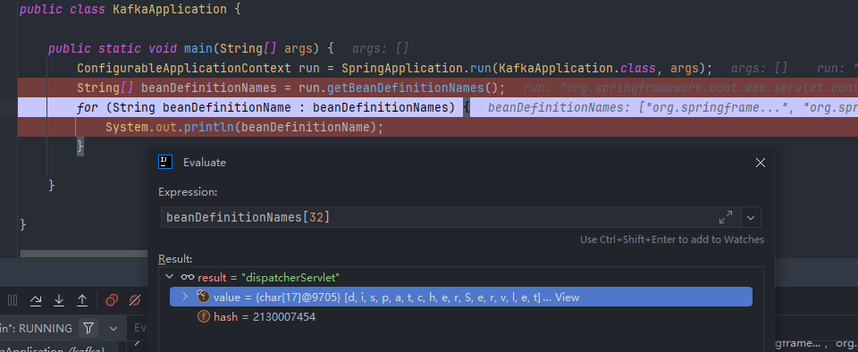

# 1. 自动装配机制 

  ## 1.1 初步理解

- 自动装配的`Tomcat`、`SpringbootMVC` 

  - 导入某个场景,容器中就会自动装配这个场景的核心组件
  - 验证:  容器中有了什么组件,就具备了什么功能

  ```java
  @SpringBootApplication
  //@EnableKafka
  //@EnableBinding(StreamClient.class)
  public class KafkaApplication {
  
      public static void main(String[] args) {
          ConfigurableApplicationContext run = SpringApplication.run(KafkaApplication.class, args);
          // 获取容器中所有名字
          String[] beanDefinitionNames = run.getBeanDefinitionNames();
          //
          for (String beanDefinitionName : beanDefinitionNames) {
              System.out.println(beanDefinitionName);
          }
  
      }
  
  }
  ```



```
注：为什么会这样?
```

## 1.2  默认包扫描规则

- `@SpringBootApplication`:  此注解标志的类就是主程序类
- `Springboot`只会扫描主程序类所在的包及其下面的子包,自动的component-scan功能
- 自定义扫描包 

  - `@ComponentScan("com.kafka")` :直接指定扫描的路径
  - `@SpringBootApplication("com.kafka")`:直接指定扫描的路径
- 配置默认值

  - **配置文件**的所有配置项是和某个**类对象的值**进行一 一绑定的.

  - 绑定的配置文件中每一项值的类叫: **属性类**

    - 比如:

      -  `ServerProperties`: 绑定所有服务器相关的配置

      - `MultipartProperties`:绑定所有文件上传相关配置
      - ....参照[官方文档](https://docs.spring.io/spring-boot/docs/current/reference/html/application-properties.html#appendix.application-properties.server)：或者参照 绑定的  **属性类**。
-  按需要加载自动配置

  - 导入场景`Spring-boot-starter-web`

    - `Springboot-boot-starter-web` 的场景启动器(`stater`)是一组预定义的依赖项集合,用于方便的添加特定场景的功能依赖.例如,导入`Springboot-boot-starter-web`用于构建`web`应用
- 场景启动器导入
  - 导入`Springboot-boot-starter`
    - `Springboot-boot-starter`是所有`starter`的`starter`,它导入了一个关键包,即`Spring-boot-autoConfigure`,这个包中包含各种场景的`AutoConfiguration`自动配置类
- `AutoConfiguration`自动配置类：
  - `Spring-boot-starter`导入了一个包`Spring-boot-autoconfigure`，包里面都是各种场景的`AutoConfiguration`自动配置类
    - `Spring-boot-autoconfigure`中包含了Spring Boot各种场景的自动配置类。这些类定义了在特定场景下，应该如何配置和初始化Spring应用程序的各个组件。
    - 虽然`Spring-boot-autoconfigure`中包含了各种自动配置类，但它们不是全都开启的。Spring Boot的自动配置是根据当前项目的依赖和配置情况以及启动时的环境来决定的。
    - 当你导入特定的场景启动器时，例如`Spring-boot-starter-web`，它会触发相应场景的自动配置，而不是全部场景的自动配置。这样，你可以根据项目的需求选择性地开启相应的功能。

```
注: 总的来说，导入场景启动器，触发`Spring-boot-autoconfigure`中相应场景的自动配置，使得在Spring Boot应用中能够按需加载所需的功能。这种设计使得开发者能够更灵活地配置项目，根据实际需求选择性地引入功能。
```

# 2.完整流程

# 2.1 思考

```
注： 
    1、SpringBoot怎么实现导一个starter、写一些简单配置，应用就能跑起来，我们无需关心整合
    2、为什么Tomcat的端口号可以配置在application.properties中，并且Tomcat能启动成功？
    3、导入场景后哪些自动配置能生效？
```


# 2.2 自动配置流程细节梳理

