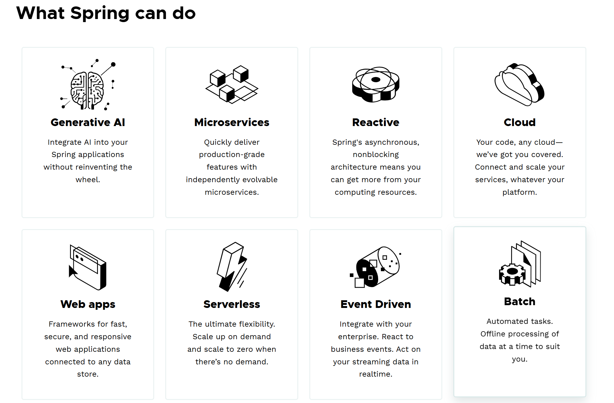
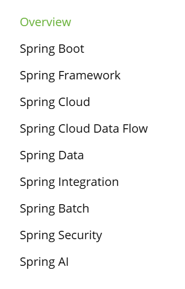
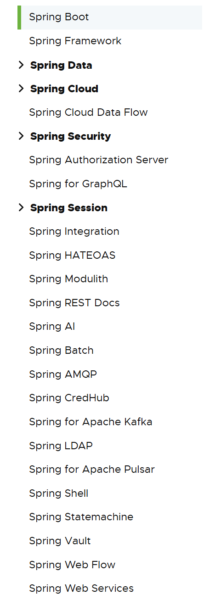

# 一.Spring和SpringBoot

 ### 1.Spring的能力

```tex
微服务
一个项目进行拆分成单个小服务。
springboot基于spring framework，简化了spring framework的复杂配置。
可以整合spring生态中的其它技术栈，免于写复杂的配置。

响应式编程
基于异步非阻塞的方式，通过应用之间构建异步数据流的方式，异步数据流允许我们只用少量的线程资源，构建高吞吐量的应用。

分布式云
项目拆分成微服务后，变成分布式应用。spring cloud用于解决这种情况。


WEB项目开发
例如springmvc开发web项目。

无服务开发，
FaaS，Function as a Service，"功能即服务"（也译作“函数即服务”）无需购买服务器，直接将服务上传到云平台，动态分配资源，


事件驱动
spring可将整个分布式系统构建出，一个基于事件方式的实时数据流。通过该数据流，就能通过响应式的方式，占用少量的资源实现高吞吐量的业务需求。


批处理。
```



### 2.Springboot 的生态

- spring宏观上，指的是整个spring生态圈。微观上，指的是spring framework 框架。



- Spring构建出了一个生态圈，包含方方面面。
  https://spring.io/projects/spring-boot
-  覆盖了：
   -  web开发
   -  数据访问
   -  安全控制
   -  分布式
   -  消息服务
   -  移动开发
   -  批处理
   -  ........



### 3.Springboot5的重大升级

- Spring5指的是整个5版本的spring生态。因为spring framework5的重大升级，所以导致了springboot 1 和 2 版本的使用方式发生了变化。

