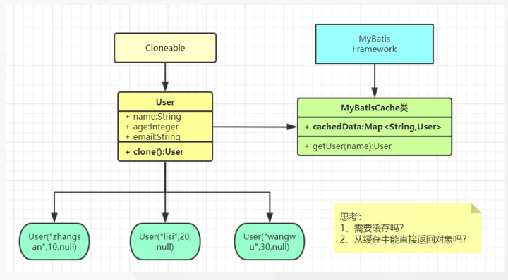

## 什么是原型模式

1.  原型模式（Prototype Pattern）是用于创建重复的对象，同时又能保证性能。
2. 本体给外部提供一个克隆体进行使用



### 代码

1. 原型模式的精髓便是实现克隆方法

```java
package com.example.studydemo.prototype;

import lombok.Data;

/**
 * @Author hgl
 * @Date 2022/3/6 19:25
 * @Description 模拟创建实体类
 */
@Data
public class User implements Cloneable{
   private String username;
   private  Integer age;

   /**
    * 重写克隆方法
    * @return
    * @throws CloneNotSupportedException
    */
   @Override
   protected Object clone() throws CloneNotSupportedException {
      User user = new User();
      user.setAge(this.age);
      user.clone();
      user.setUsername(this.username);
      return user;
   }
}
```

```java
package com.example.studydemo.prototype;

import java.util.HashMap;
import java.util.Map;

/**
 * @Author hgl
 * @Date 2022/3/6 19:26
 * @Description 模拟查询数据库
 */
public class Mybatis {

    /**
     * 缓存user
     */
    private final Map<String, User> userCache = new HashMap();

    public User getUser(String username) throws CloneNotSupportedException {
        User user;
        // 如果缓存中没有
        if (!userCache.containsKey(username)) {
            // 数据库中查询
            user = getUserFromDb(username);
        } else {
            // 如果有则从缓存中获取,但是不能直接返回
            user = userCache.get(username);
            // 从这个对象快速得到一个克隆体 == 原型模式
            user = (User) user.clone();
        }
        return user;
    }

    /**
     * 模拟数据库查询
     *
     * @param username username
     * @return User
     */
    private User getUserFromDb(String username) throws CloneNotSupportedException {
        User user = new User();
        user.setUsername("sz");
        user.setAge(23);
        // 给缓存中存放克隆体

        userCache.put(username, (User) user.clone());
        return user;
    }
}
```


```java
package com.example.studydemo.prototype;

/**
 * @Author hgl
 * @Date 2022/3/6 19:15
 * @Description  模拟调用
 *
 *  用于创建重复对象,同时保证性能
 *  1. mybatis: 操作数据库,从数据库里面查询出大量数据(70%改变很少)
 *  2. 每次查数据库,查到以后把所有的数据都封装成一个对象,返回.
 *    10000 thread : 查询一个记录: new User("zs",18);  每创建一个对象封装并返回
 *     系统里面就会有10000 个user;浪费内存
 *    问题: 直接从缓存中返回,会有脏缓存的问题(同一条数据会有被修改删除操作,导致数据的不一致)
 *
 * 
 *
 */
public class Prototype {

    public static void main(String[] args) {
        Mybatis mybatis = new Mybatis();
        try {
            mybatis.getUser("zs");
        } catch (CloneNotSupportedException e) {
            e.printStackTrace();
        }
    }
}
```

注意: 本体给外部提供一个克隆体使用,不修改克隆体

## 使用场景

- 资源优化

- 性能和安全要求

- 一个对象多个修改者的场景。

- 一个对象需要提供给其他对象访问，而且各个调用者可能都需要修改其值时可以考虑使用原型模式拷贝多个对象供调用者使用。

- 深（两个完全对象不一样的【递归克隆】，内容却完全一样）、浅（只是属性赋值）....
  ......

   `原型模式已经与 Java 融为浑然一体，大家可以随手拿来使用。`