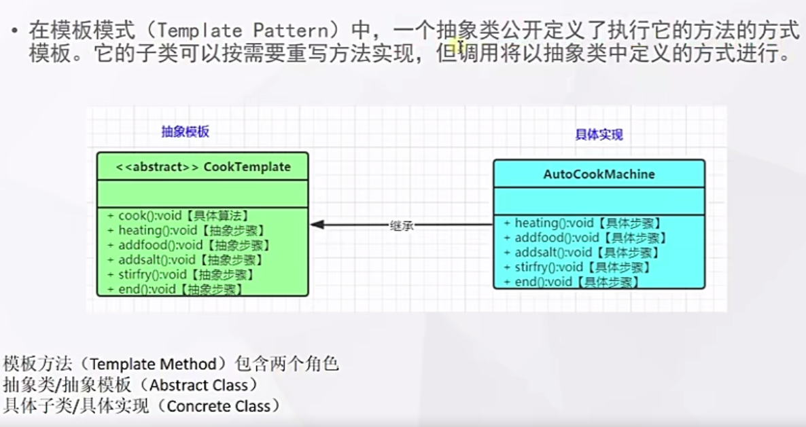

# 什么是模板方法



## 代码

```java
public class AutoCookMachine extends CookTemplate {
    @Override
    public void addFood() {
        System.out.println("白菜");
    }

    @Override
    public void addSalt() {
        System.out.println("放了三勺盐");
    }
}
```

```java
public abstract class CookTemplate {

    /**
     * 定义算法
     */
    public void cook() {
        heating();
        addFood();
        addSalt();
        strifry();
        end();
    }

    // 加热方法
    public void heating() {
        System.out.println("开火.....");
    }

    // 添加食物
    public abstract void addFood();

    // 添加盐
    public abstract void addSalt();

    // 翻炒
    public void strifry() {
        System.out.println("翻炒中.....");
    }

    // 出锅
    public void end() {
        System.out.println("出锅.....");
    }

}
```

# 使用场景

- Spring的整个继承体系都基本用到模板方: `BeanFactory`
- `BeanFactory.getBean(1,2,3,4)`--`A1`---`A2`---`A3`---`A4`（全部被完成）
- `JdbcTemplate`、`RedisTemplate`都允许我们再扩展.....
- 我们自己的系统也应该使用模板方法组织类结构