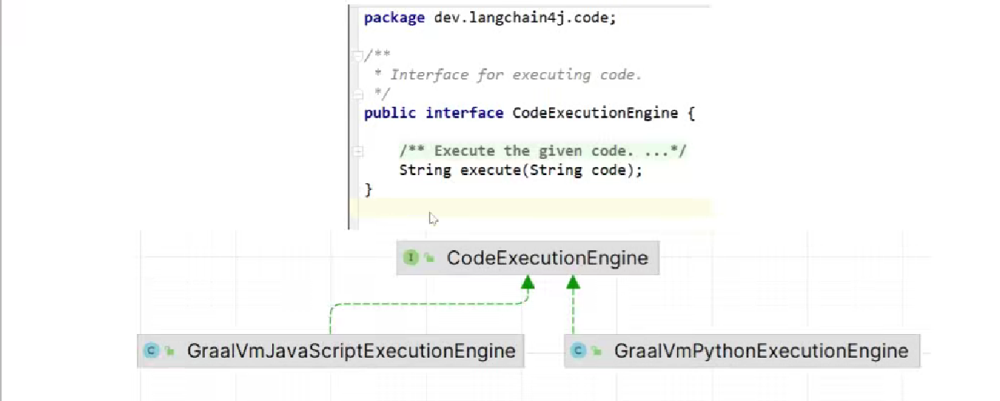

# 一.`LangChain4j`之`functionCalling`

## 1.1   `functionCalling`是什么

- 功能调用/函数调用（`Function Caling`）"**<font color="red">允许大型语言模型（`LLM`）在必要时调用一个或多个可用的工具，这些工具通常由开发者定义</font>**"。工具可以是任何
  东西：网页搜索、对外部`API`的调用，或特定代码的执行等。`LLM`本身不能实际调用工具：相反，它们会在响应中表达调用特定工具的意图（
  而不是以纯文本回应）。然后，我们应用程序应该执行这个工具，并报告工具执行的结果给模型。

- 例如，我们知道`LLM`自身在数学方面不是特别擅长。如果你的用例偶尔涉及数学计算，你可能会想提供给`LLM`一个“数学工具”。通过在请求中
  声明一个或多个工具，`LLM`可以在认为合适时调用其中之一。给定一个数学问题和一组数学工具，`LLM`可能会决定为正确回答问题，它应该首
  先调用其中一个提供的数学工具。
- 一些`LLM`除了生成文本外,还可以触发操作。

## 1.2 函数调用


```html
注: **<font color="red">重要提示：LLM本身并不执行函数，它只是指示应该调用哪个函数以及如何调用</font>**
```

## 1.3  开发步骤 

新建大模型调用功能接口

```java
// 统一接口
public interface FunctionAssistant {

    //  输入： 帮我开具发票，开票信息是 ：xxxxx有限公司 税号: xx 金额
    String chat(String message);
}


// 实现方式一
@Bean 
public FunctionAssistant functionAssistant(ChatLanguageModel chatLanguageModel) {
        // 工具说明 ToolSpecification
        ToolSpecification toolSpecification = ToolSpecification.builder()
                .name("invoice_assistant")
                .description("根据用户提交的开票信息，开具发票")
                .addParameter("companyName", type("string"), description("公司名称"))
                .addParameter("dutyNumber", type("string"), description("税号"))
                .addParameter("amount", type("string"), description("金额，保留两位有效数字"))
                .build();

        // 业务逻辑 ToolExecutor
        ToolExecutor toolExecutor = (toolExecutionRequest, memoryId) -> {
            System.out.println(toolExecutionRequest.id());
            System.out.println(toolExecutionRequest.name());
            String arguments1 = toolExecutionRequest.arguments();
            System.out.println("arguments1 =>>>> " + arguments1);
            return "开具成功";
        };

        return AiServices.builder(FunctionAssistant.class)
                .chatLanguageModel(chatLanguageModel)
                .tools(Map.of(toolSpecification, toolExecutor))
                .build();
    }


// 实现方式二
@Slf4j
public class InvoiceHandler
{

    @Tool("根据用户提交的开票信息进行开票")
    public String handle(@P("公司名称") String companyName,
                         @P("税号") String dutyNumber,
                         @P("金额保留两位有效数字") String amount) throws Exception
    {
        log.info("companyName =>>>> {} dutyNumber =>>>> {} amount =>>>> {}", companyName, dutyNumber, amount);
        //----------------------------------
        // 这块写自己的业务逻辑，调用redis/rabbitmq/kafka/mybatis/顺丰单据/医疗化验报告/支付接口等第3方
        //----------------------------------
      
        return "开票成功";
    }
}


@Bean
public FunctionAssistant functionAssistant(ChatLanguageModel chatLanguageModel) {

        return AiServices.builder(FunctionAssistant.class)
                .chatLanguageModel(chatLanguageModel)
                .tools(new InvoiceHandler())
                .build();
    }


```

```html
注:  **<font color="red">方法二使用了@Tool,可以更方便的集成函数调用,只需将`Java` 方法标注为`@Tool`,`LangChain4j`就会自动将其装换为`ToolSpecification`</font>
```

- 尝试真实调用天气服务 

```java

// 配置天气服务工具
@Service
public class WeatherService
{
    //天气开发服务
    private static final String API_KEY = "xxxxxx"; // 替换成你自己的和风天气API密钥
    private static final String BASE_URL = "xxxxxxxxxx";

    public JsonNode getWeatherV2(String city) throws Exception {
        String url = String.format(BASE_URL, city, API_KEY);
        // 使用默认配置创建HttpClient实例
        var httpClient = HttpClients.createDefault();

        // 创建请求工厂并将其设置给RestTemplate
        HttpComponentsClientHttpRequestFactory factory = new HttpComponentsClientHttpRequestFactory(httpClient);
        String response = new RestTemplate(factory).getForObject(url, String.class);

        // 解析JSON响应
        JsonNode jsonNode = new ObjectMapper().readTree(response);
        return jsonNode;
    }
}

@Slf4j
public class InvoiceHandler
{

    @Tool("根据用户提交的开票信息进行开票")
    public String handle(@P("公司名称") String companyName,
                         @P("税号") String dutyNumber,
                         @P("金额保留两位有效数字") String amount) throws Exception
    {
        log.info("companyName =>>>> {} dutyNumber =>>>> {} amount =>>>> {}", companyName, dutyNumber, amount);
        //----------------------------------
        // 这块写自己的业务逻辑，调用redis/rabbitmq/kafka/mybatis/顺丰单据/医疗化验报告/支付接口等第3方
        //----------------------------------
        System.out.println(new WeatherService().getWeatherV2("101010100"));

        return "开票成功";
    }
}


//  调用
@Bean
public FunctionAssistant functionAssistant(ChatLanguageModel chatLanguageModel) {

        return AiServices.builder(FunctionAssistant.class)
                .chatLanguageModel(chatLanguageModel)
                .tools(new InvoiceHandler())
                .build();
    }


```

# 二.`LangChain4j`之动态函数调用

## 1.GraalVM 简介

- GraalVM 是由 Oracle 开发的一款高性能、多语言虚拟机。它支持 Java、JavaScript、Ruby、R、Python 等多种编程语言，并提供了高效的运行环境。该虚拟机适用于多种编程场景，尤其适合需要高性能和低资源消耗的应用。

- 原理:

  

- 代码:
```java
 /**
     * 斐波那契数列是指这样一个数列：0，1，1，2，3，5，8，13，21，34，55，89……
     * 这个数列从第3项开始 ，每一项都等于前两项之和
     */
    public static void main(String[] args)
    {
        //fibonacciByJavaScript();
        fibonacciByPython();
    }


    private static void fibonacciByJavaScript()
    {
        CodeExecutionEngine javaScriptExecutionEngine = new GraalVmJavaScriptExecutionEngine();

        //斐波那契数列的定义：每一项都是前两项的和，除了最开始的两个指定数值外
        String code =
        """
            function fibonacci(n) 
            {
                if (n <= 1) return n;
                return fibonacci(n - 1) + fibonacci(n - 2);
            }
                            
            fibonacci(7)
        """;


        String result = javaScriptExecutionEngine.execute(code);
        System.out.println(result);
    }

    private static void fibonacciByPython()
    {
        CodeExecutionEngine pythonExecutionEngine = new GraalVmPythonExecutionEngine();

        String code = """
        def fibonacci_recursive(n):
            if n <= 1:
                return n
            else:
                return fibonacci_recursive(n-1) + fibonacci_recursive(n-2)
        
        # 打印前6个斐波那契数
        fibonacci_recursive(5)
        """;

        String result = pythonExecutionEngine.execute(code);
        System.out.println(result);
    }

 
  @GetMapping(value = "/chatgraalvm/test1")
    public String test1(@RequestParam("prompt") String prompt)
    {
        //斐波那契数列的定义：每一项都是前两项的和，除了最开始的两个指定数值外
        String code = """
        function fibonacci(n) {
            if (n <= 1) return n;
            return fibonacci(n - 1) + fibonacci(n - 2);
        }
                        
        fibonacci(8)
        """;

        //String result = aiAssistant.chat("勾股定理有哪些组合");
        //String result = aiAssistant.chat("16开平方等于多少");
        String result = aiAssistant.chat(code);
        System.out.println(result);


        return "success : "+ DateUtil.now() + "\t"+result;
    }
```

```html
注:  **<font color="red">上面方法中8可以替换为prompt</font>
```

## 1.动态函数是什么

- 在 `LangChain4j`中，动态函数提供了一种灵活的方式，将预定义的业务函数与语言模型结合，使得系统能在运行时根据具体的上下文自动选择和调用适当的函数来完成任务。通过这种方式，不仅提升了系统的智能化程度，也让业务逻辑更加清晰和模块化。