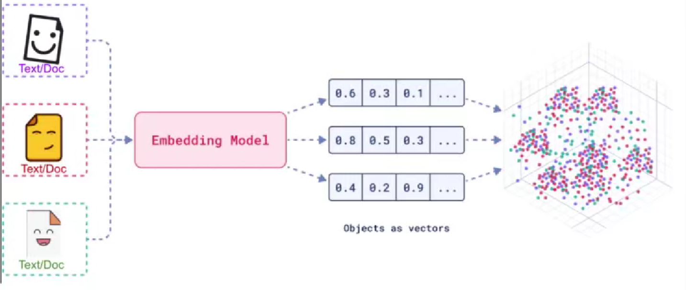

# 一.什么是RAG

- 检索增强生成

# 二.什么是向量存贮

- 向量化: 一堆浮点型数组
- 数据相同,坐标越接近

# 三.嵌入模型(Embedding Model)

- 核心概念
  - 嵌入（`Embedding`）的工作原理是将文本、图像和视频转换为称为向量（`Vectors`）的浮点数数组。这些向
    量旨在捕捉文本、图像和视频的含义。嵌入数组的长度称为向量的维度（`Dimensionality`）
  - 嵌入模型（`EmbeddingModel`）是嵌入过程中采用的模型。当前`EmbeddingModel`的接口主要用于将文本
    转换为数值向量，接口的设计主要围绕这两个目标展开：
    - 移植性：该接口确保在各种嵌入模型之间的轻松适配。它允许开发者在不同的嵌入技术或模型
      之间切换，所需的代码更改最小化。这一设计与Spring模块化和互换性的理念一致。
    - 单性：嵌入模型简化了文本转换为嵌入的过程。通过提供如`embed`(`String text`）和`embed`（`Document
      document`)这样简单的方法，它去除了处理原始文本数据和嵌入算法的复杂性。这个设计选择使开
      发者，尤其是那些初次接触AI的开发者，更容易在他们的应用程序中使用嵌入，而无需深入了解
      其底层机制。

# 四.向量数据库(Embedding Store)

- 该`EmbeddingStore`接口表示s的存储`Embedding`。也称为向量数据库。它允许存储和高效搜索相心的（在嵌入空间中
  接近的）`EmbeddingS`
- [目前支持的嵌入商店可以在这里找到](https://docs.langchain4j.dev/tutorials/rag/#embedding-store)

- `EmbeddingStore`可以Embedding单独存储或与相应的一起存储`TextSegment`
  - 它只能通过ID存储Embedding。原始嵌入数据可以存储在其他地方，并使用ID进行关联。
  - 它可以存储`Embeding`和已嵌入的原始数据（通常是`TextSegmen`t）。

