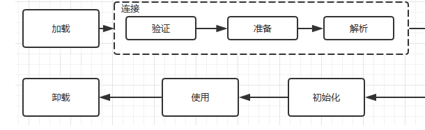

# 1类加载

## 1.1、类的生命周期

​		一个类的完整生命周期,会经历五个阶段,分别为: **加载、验证、准备、解析、初始化**。在这五个阶段中加载、验证、准备和初始化这四个阶段发生的顺序是确定的,而解析阶段则不一定,它在某些情况下可以在初始化阶段之后开始,这是为了支持Java语言的[运行时绑定](https://blog.csdn.net/youngyouth/article/details/79747043)(也成为[动态绑定或晚期绑定](https://blog.csdn.net/weixin_43621315/article/details/123880535)).
需要注意的是这里的几个阶段是按顺序开始,而不是按顺序进行或者完成,因为这些阶段通常都是相互交叉地混合进行的,通常在一个阶段执行的过程中调用或激活另一个阶段。

- 类的加载机制:查找并加载类的二进制
- 连接
  - 验证: 确保被加载的类准确性
  - 准备: 
  - 解析:
